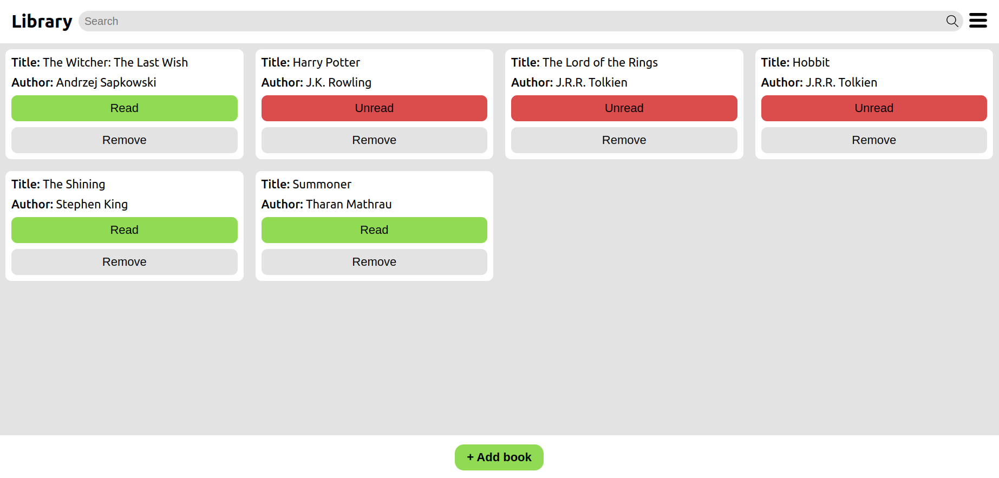
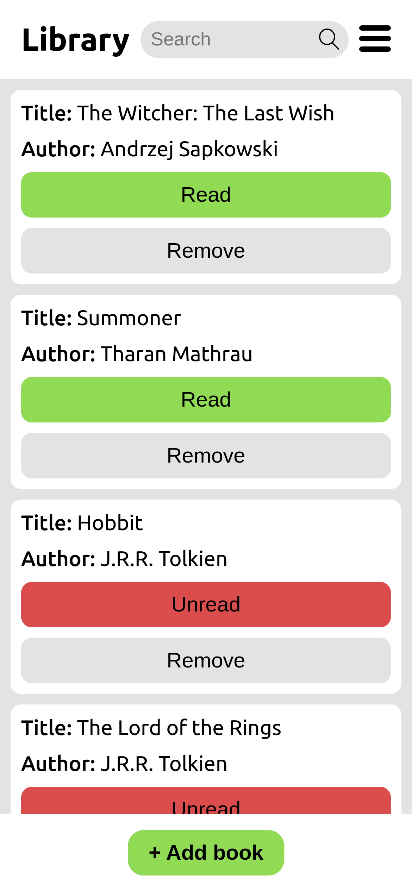

# Book Library
A simple library app that allows you to keep track of books you have read or want to read.

## Demo
[Live](https://library-lewocz.netlify.app/)

## Desktop

## Phone

## Features

- Add new books with a title, author and read status
- Edit read status of existing books
- Remove books from the library
- Sort books by title or author or read
- Search for books by title or author

## Technologies Used

- HTML
- CSS
- JavaScript
